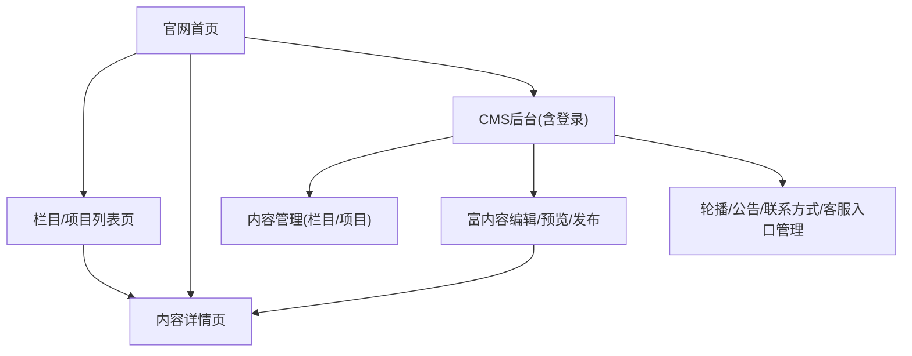

## 1. Product Overview
为商务咨询公司提供「官网展示 + 简易CMS后台」一体化方案，实现内容可视化维护与快速发布。
面向公司运营人员，低成本管理栏目/项目/详情页内容、首页轮播与公告、联系方式与客服入口。

## 2. Core Features

### 2.1 User Roles
| 角色 | 注册/登录方式 | 核心权限 |
|------|---------------|----------|
| 访客(未登录) | 无需注册 | 浏览已发布的官网内容、查看公告与联系方式、使用客服悬浮入口 |
| 管理员(后台用户) | Supabase Auth 邮箱登录(可邀请开通) | 管理栏目/项目/页面富内容、上下线发布、管理轮播/公告/联系方式/客服入口 |

### 2.2 Feature Module
本产品由以下核心页面组成：
1. **官网首页**：公司价值主张展示、导航入口、轮播位、公告栏、精选栏目/项目入口、联系方式与客服悬浮入口。
2. **栏目/项目列表页**：按栏目展示项目列表与筛选、列表卡片信息与跳转详情。
3. **内容详情页**：展示富内容详情(含图片/引用/列表等)、相关信息、联系方式与客服悬浮入口。
4. **CMS后台(含登录)**：内容管理(栏目/项目/页面)、富内容编辑与发布、轮播/公告/联系方式管理、预览与发布状态。

### 2.3 Page Details
| Page Name | Module Name | Feature description |
|-----------|-------------|---------------------|
| 官网首页 | 顶部导航 | 展示主导航(首页/栏目/项目/联系我们等)，提供进入列表页与后台入口(仅管理员可见)。 |
| 官网首页 | 首页轮播 | 展示轮播图与标题/摘要；按发布顺序轮播；支持跳转到指定详情/列表/外链。 |
| 官网首页 | 公告栏 | 展示最新公告列表与发布时间；支持点击进入公告详情(复用内容详情页)。 |
| 官网首页 | 栏目/项目入口 | 展示精选栏目与项目卡片；支持跳转到对应列表/详情。 |
| 官网首页 | 联系方式区块 | 展示电话/邮箱/地址/工作时间/二维码(可选)；内容来自后台配置。 |
| 官网首页 | 客服悬浮入口 | 右下角悬浮按钮；点击弹出联系方式/表单引导(如电话/微信/邮箱)；配置来自后台。 |
| 栏目/项目列表页 | 列表与筛选 | 按栏目查看项目列表；支持关键字段筛选(如行业/服务类型/标签)与分页/加载更多。 |
| 栏目/项目列表页 | 列表卡片 | 展示标题/摘要/封面/标签；点击进入内容详情页。 |
| 内容详情页 | 富内容渲染 | 渲染后台编辑的富内容(标题、段落、图片、列表、引用等)；支持封面图与目录(可选)。 |
| 内容详情页 | SEO信息 | 使用后台维护的标题/描述/OG图；用于分享与搜索展示。 |
| 内容详情页 | 联系方式与客服入口 | 固定展示联系方式区块与悬浮客服入口，便于转化。 |
| CMS后台(含登录) | 登录与权限 | 使用邮箱登录；未登录访问后台路由自动跳转登录；仅管理员可进入管理功能。 |
| CMS后台(含登录) | 内容管理(栏目) | 新增/编辑/下线栏目；配置名称、slug、排序、是否在首页展示。 |
| CMS后台(含登录) | 内容管理(项目/文章) | 新增/编辑/下线项目；维护标题、摘要、封面、所属栏目、标签、富内容、SEO字段、发布时间。 |
| CMS后台(含登录) | 富内容编辑器 | 提供所见即所得编辑；支持图片上传、基础排版；保存草稿、预览、发布/撤回。 |
| CMS后台(含登录) | 轮播管理 | 新增/编辑/排序/上下线轮播项；配置图片、标题、跳转链接。 |
| CMS后台(含登录) | 公告管理 | 新增/编辑/发布公告；公告可复用为内容详情页展示。 |
| CMS后台(含登录) | 联系方式管理 | 维护电话/邮箱/地址/地图链接等；官网所有页面同步展示最新配置。 |
| CMS后台(含登录) | 客服入口管理 | 配置悬浮按钮文案/图标、弹窗内容(电话/微信/邮箱等)、开关状态。 |

## 3. Core Process
**访客流程**：
1) 进入官网首页，浏览轮播与公告，查看精选栏目/项目。
2) 进入栏目/项目列表页，筛选并打开感兴趣的内容。
3) 在内容详情页阅读富内容，使用联系方式区块或客服悬浮入口进行咨询。

**管理员流程**：
1) 访问CMS后台并登录。
2) 在内容管理中创建/编辑栏目与项目，使用富内容编辑器完善详情。
3) 预览内容效果，确认后发布；必要时撤回/下线。
4) 在“轮播/公告/联系方式/客服入口”中维护官网运营信息，实时生效。

