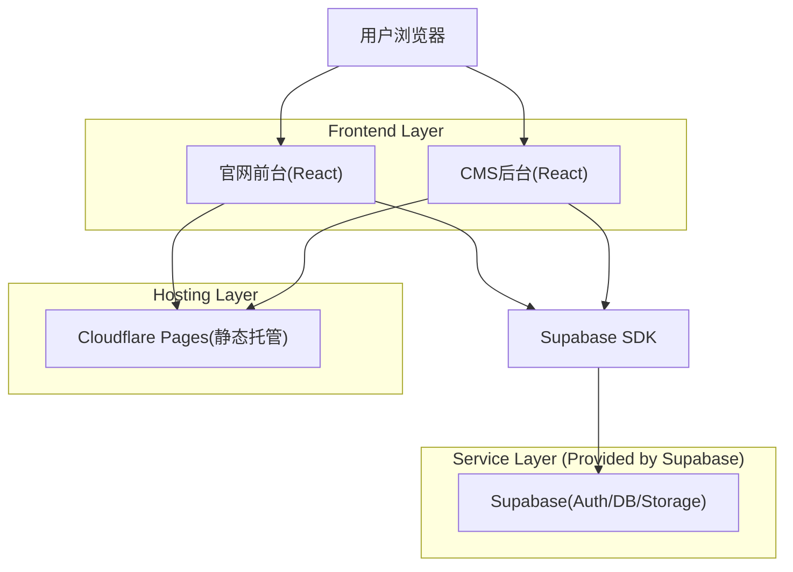
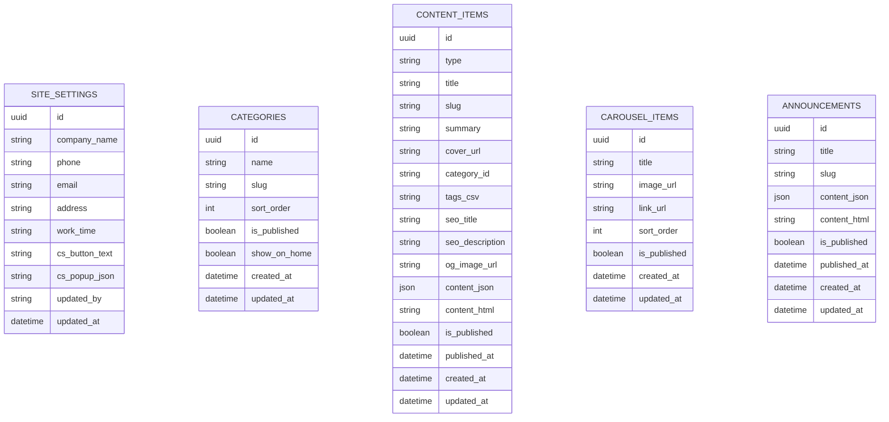

## 1.Architecture design


## 2.Technology Description
- Frontend: React@18 + vite + TypeScript + tailwindcss@3
- CMS编辑器: tiptap (富文本/富内容JSON)
- Backend: Supabase (Auth + Postgres + Storage)
- 部署/域名: Cloudflare Pages (托管前端静态产物)，通过环境变量配置 Supabase URL/Anon Key

## 3.Route definitions
| Route | Purpose |
|-------|---------|
| / | 官网首页：轮播、公告、精选内容、联系方式、客服入口 |
| /list/:categorySlug | 栏目/项目列表：筛选、分页、跳转详情 |
| /detail/:contentSlug | 内容详情：富内容渲染、SEO、咨询入口 |
| /admin | CMS入口：未登录跳转 /admin/login |
| /admin/login | 管理员登录 |
| /admin/content | 内容管理：栏目/项目/页面/公告 |
| /admin/editor/:type/:id | 富内容编辑：草稿/预览/发布 |
| /admin/settings | 轮播/公告/联系方式/客服入口配置 |

## 6.Data model(if applicable)

### 6.1 Data model definition


### 6.2 Data Definition Language
Site配置表 (site_settings)
```
CREATE TABLE site_settings (
  id UUID PRIMARY KEY DEFAULT gen_random_uuid(),
  company_name TEXT NOT NULL DEFAULT '',
  phone TEXT NOT NULL DEFAULT '',
  email TEXT NOT NULL DEFAULT '',
  address TEXT NOT NULL DEFAULT '',
  work_time TEXT NOT NULL DEFAULT '',
  cs_button_text TEXT NOT NULL DEFAULT '在线咨询',
  cs_popup_json JSONB NOT NULL DEFAULT '{}'::jsonb,
  updated_by TEXT NOT NULL DEFAULT '',
  updated_at TIMESTAMPTZ NOT NULL DEFAULT NOW()
);
```

栏目表 (categories)
```
CREATE TABLE categories (
  id UUID PRIMARY KEY DEFAULT gen_random_uuid(),
  name TEXT NOT NULL,
  slug TEXT UNIQUE NOT NULL,
  sort_order INT NOT NULL DEFAULT 0,
  is_published BOOLEAN NOT NULL DEFAULT TRUE,
  show_on_home BOOLEAN NOT NULL DEFAULT FALSE,
  created_at TIMESTAMPTZ NOT NULL DEFAULT NOW(),
  updated_at TIMESTAMPTZ NOT NULL DEFAULT NOW()
);
CREATE INDEX idx_categories_sort ON categories(sort_order);
```

内容表 (content_items) — 用于“项目/案例/文章/页面”等(由 type 区分)
```
CREATE TABLE content_items (
  id UUID PRIMARY KEY DEFAULT gen_random_uuid(),
  type TEXT NOT NULL, -- 'project' | 'page' | 'case' 等
  title TEXT NOT NULL,
  slug TEXT UNIQUE NOT NULL,
  summary TEXT NOT NULL DEFAULT '',
  cover_url TEXT NOT NULL DEFAULT '',
  category_id TEXT NOT NULL DEFAULT '', -- logical FK: categories.id
  tags_csv TEXT NOT NULL DEFAULT '',
  seo_title TEXT NOT NULL DEFAULT '',
  seo_description TEXT NOT NULL DEFAULT '',
  og_image_url TEXT NOT NULL DEFAULT '',
  content_json JSONB NOT NULL DEFAULT '{}'::jsonb,
  content_html TEXT NOT NULL DEFAULT '',
  is_published BOOLEAN NOT NULL DEFAULT FALSE,
  published_at TIMESTAMPTZ,
  created_at TIMESTAMPTZ NOT NULL DEFAULT NOW(),
  updated_at TIMESTAMPTZ NOT NULL DEFAULT NOW()
);
CREATE INDEX idx_content_type_pub ON content_items(type, is_published);
CREATE INDEX idx_content_category ON content_items(category_id);
```

轮播表 (carousel_items)
```
CREATE TABLE carousel_items (
  id UUID PRIMARY KEY DEFAULT gen_random_uuid(),
  title TEXT NOT NULL DEFAULT '',
  image_url TEXT NOT NULL,
  link_url TEXT NOT NULL DEFAULT '',
  sort_order INT NOT NULL DEFAULT 0,
  is_published BOOLEAN NOT NULL DEFAULT TRUE,
  created_at TIMESTAMPTZ NOT NULL DEFAULT NOW(),
  updated_at TIMESTAMPTZ NOT NULL DEFAULT NOW()
);
CREATE INDEX idx_carousel_sort ON carousel_items(sort_order);
```

公告表 (announcements)
```
CREATE TABLE announcements (
  id UUID PRIMARY KEY DEFAULT gen_random_uuid(),
  title TEXT NOT NULL,
  slug TEXT UNIQUE NOT NULL,
  content_json JSONB NOT NULL DEFAULT '{}'::jsonb,
  content_html TEXT NOT NULL DEFAULT '',
  is_published BOOLEAN NOT NULL DEFAULT FALSE,
  published_at TIMESTAMPTZ,
  created_at TIMESTAMPTZ NOT NULL DEFAULT NOW(),
  updated_at TIMESTAMPTZ NOT NULL DEFAULT NOW()
);
CREATE INDEX idx_announce_pub ON announcements(is_published, published_at DESC);
```

Supabase权限建议(最小可用，RLS按需开启并添加策略)
```
-- 基础读权限给 anon（仅用于已发布内容；实际建议配合 RLS 策略限制 is_published=true）
GRANT SELECT ON categories TO anon;
GRANT SELECT ON content_items TO anon;
GRANT SELECT ON carousel_items TO anon;
GRANT SELECT ON announcements TO anon;
GRANT SELECT ON site_settings TO anon;

-- 完整权限给 authenticated（后台管理）
GRANT ALL PRIVILEGES ON categories TO authenticated;
GRANT ALL PRIVILEGES ON content_items TO authenticated;
GRANT ALL PRIVILEGES ON carousel_items TO authenticated;
GRANT ALL PRIVILEGES ON announcements TO authenticated;
GRANT ALL PRIVILEGES ON site_settings TO authenticated;
```

Cloudflare部署要点(前端)
- 使用 Cloudflare Pages 部署前台与后台(可同仓库同项目，路由由前端接管)。
- 在 Pages 项目环境变量中配置：VITE_SUPABASE_URL、VITE_SUPABASE_ANON_KEY。
- 静态资源：内容图片优先存 Supabase Storage，前端按公开URL渲染；后台上传后写入 image_url/cover_url。
